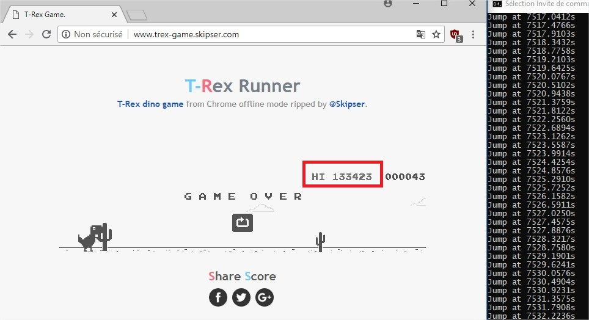
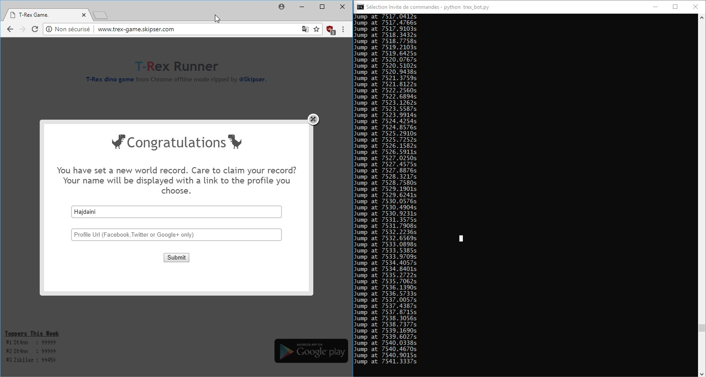

# BEFORE RUNNING THE SCRIPT !

## This will only work ...

- If you have **1600x900 screen resolution**
- If and only if you divide your window by 2 (one window for the T-rex game and the other you put what you want)
- If it is only the day mode (the website have only the day mode : http://www.trex-game.skipser.com/) 
- If you only download those modules : 

```
pip install Pillow
pip install numpy
pip install PyAutoGUI
```

## How it works : 

```
python trex_bot.py
```

## Some screenshot : 



