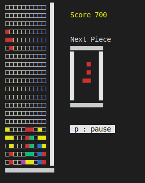

# Tetris

## Description

This is my Tetris game that works in console mode using curses library.

## Prerequisites

To run the game on Windows, install windows-curses:

```bash
pip3 install windows-curses
```

## Screenshots


